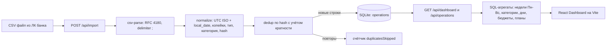

# Архитектура Cashflows — Этап 1 (проектирование)

> Продукт: простое и надёжное (simple yet robust) TypeScript-приложение «одностраничный фронт + бек»,
> принимающее CSV-выгрузки из ЛК Т-Банка и агрегирующее данные для дашборда:
> неделя/неделя, план/факт, доходы/расходы, бюджеты.
>
> Источник истины по формату входных данных: [`samples/CSV_FORMAT.md`](../samples/CSV_FORMAT.md).
> Этот документ — план для Этапа 2 (backend) и Этапа 3 (frontend). Код реализации здесь не приводится.

---

## 0. Резюме принятых решений

| Вопрос | Решение |
|---|---|
| Рантайм | Node.js 22 LTS + TypeScript 5 (strict) |
| HTTP-фреймворк | **Fastify 5** (+ `@fastify/multipart`, `@fastify/static`), без CORS-плагина |
| БД | **SQLite через `better-sqlite3`**, без ORM, чистый SQL + prepared statements |
| Фронт | **Vite + React 19 + TS**, без роутера и стейт-менеджера |
| Графики | **Recharts** (бар по дням, донат по категориям) |
| Монорепо | Один корневой `package.json`, папки `server/`, `web/`, `shared/`; без npm-workspaces |
| Деньги | Целые **копейки** (INT) везде: в БД, API, UI-математике |
| Время | Даты храним двойнями: UTC ISO-мгновение + `local_date` (календарный день Europe/Moscow) |
| Порты | API/прод: **3000**; Vite dev: **5173** (прокси `/api` → 3000, CORS не нужен) |
| Dev-раннер сервера | `tsx watch`; прод-сборка — `tsc` |

---

## 1. Контекст и цели

- Вход: CSV-выгрузка банка (см. [`samples/CSV_FORMAT.md`](../samples/CSV_FORMAT.md)): UTF-8 без BOM, CRLF,
  разделитель `;`, все поля в кавычках, 17 колонок с русскими заголовками, даты `DD.MM.YYYY HH:mm:ss`
  (Europe/Moscow), суммы с запятой-десятичным разделителем, минус = расход.
- Выгрузки импортируются повторно и с пересекающимися периодами → нужна идемпотентная дедупликация.
- Внутренние переводы между своими счетами приходят зеркальными парами и помечены
  `Учёт в аналитике = Нет` → исключаются из план/факт и агрегатов.
- Дашборд: неделя/неделя (Пн–Вс по Москве), план/факт по доходам и расходам, разбивка по категориям
  и по дням, прогресс бюджетов.

Нецелевое (осознанно): Docker, SSR, ORM, миграционные фреймворки, очереди, мультивалютная конверсия,
аутентификация (однопользовательский локальный инструмент).

---

## 2. Стек и обоснование

### 2.1. Сервер: Fastify 5 (а не Express)

- **Валидация из коробки**: Fastify изначально «schema-first» (JSON Schema), а мы всё равно подключаем
  `zod` — Fastify-хуки позволяют аккуратно встроить zod-валидацию тел/квери и отдавать 400 с деталями.
- **Multipart без зоопарка**: `@fastify/multipart` — официальный плагин для загрузки CSV.
  В Express понадобились бы отдельные `multer` + `body-parser` + ручной error handling.
- **Меньше бойлерплейта при равной надёжности**: встроенный logger (pino), быстрые хуки,
  TypeScript-типы из коробки. Express — тонкая обёртка над http, где «надёжно» надо докручивать руками.
- Производительность здесь не критерий (локальный однопользовательский сервис), критерий —
  минимум кода инфраструктуры при предсказуемом поведении.

### 2.2. БД: SQLite (`better-sqlite3`), без ORM

Почему не JSON-файл: ядро приложения — агрегатные запросы (GROUP BY по категориям/дням, сравнение
периодов, подсчёт существующих хешей для дедупликации). На SQL это 3–5 простых запросов; на
JSON-файле — ручные свёртки в памяти, сортировки и растущая связка кода. SQLite остаётся
«нулевым сервисом»: один файл `data/cashflows.sqlite`, никакой установки и демонов.

Почему `better-sqlite3`: синхронный API (идеален для одного пользователя, без колбечного ада),
подготовленные выражения, транзакции, prebuilt-бинары под macOS/Linux/Windows. WAL-режим.
Альтернатива, если нативный модуль нежелателен: встроенный `node:sqlite` (Node ≥ 24) — интерфейс
изолируется в `server/src/db.ts`, замена прозрачна. Для Этапа 2 фиксируем `better-sqlite3`.

ORM не используется: 4 таблицы, схема стабильна, `CREATE TABLE IF NOT EXISTS` в `db.ts` — и это весь
«миграционный» механизм Этапа 1.

### 2.3. Фронт: Vite + React + TS, Recharts

- Vite — де-факто стандарт, нулевой конфиг для React+TS, dev-сервер с прокси.
- React без роутера: приложение одностраничное, навигация — табы через локальный state.
  Без Redux/Zustand/React-Query: данные тянутся функциями из `web/src/api.ts`, кеш не нужен
  (локальный SQLite отвечает за миллисекунды).
- Графики — **Recharts**: декларативные React-компоненты, покрывает нужные два графика
  (столбцы доход/расход по дням, донат по категориям), без императивных обёрток.
  Альтернатива при preocupации по бандлу — `chart.js` + `react-chartjs-2`; Recharts выбран за
  простоту интеграции.

### 2.4. Монорепо без магии

- Один корневой `package.json` со **всеми** зависимостями и скриптами; `npm-workspaces` не используем
  (не нужны: одинаковый node_modules, ноль проблем хоистинга).
- Общие типы API — единственный файл [`shared/types.ts`](shared/types.ts), импортируется обоими
  проектами **относительным путём** (`../../shared/types`), типы стираются на компиляции.
- Единственная «клеевая» зависимость — `concurrently` (параллельный dev сервера и веба).

Полный список зависимостей:

| Группа | Пакеты |
|---|---|
| server runtime | `fastify`, `@fastify/multipart`, `@fastify/static`, `better-sqlite3`, `zod`, `csv-parse` |
| dev | `typescript`, `tsx`, `@types/node`, `@types/better-sqlite3`, `concurrently` |
| web runtime | `react`, `react-dom`, `recharts` |
| web dev | `vite`, `@vitejs/plugin-react` |

`csv-parse` (синхронный режим `csv-parse/sync`) выбран вместо самописного парсера: гарантии RFC 4180
(кавычки, `""`, многострочные ячейки) нужны обязательно — см. §7 рекомендаций
[`samples/CSV_FORMAT.md`](../samples/CSV_FORMAT.md).

---

## 3. Поток данных



---

## 4. Структура проекта

```
cashflows/
├── package.json                  # один на всё: скрипты + все зависимости
├── tsconfig.base.json            # общие опции strict; сервер/веб наследуют
├── .gitignore                    # node_modules, dist, data/*.sqlite*
├── docs/
│   └── ARCHITECTURE.md           # этот документ
├── samples/                      # образцы выгрузок (уже есть)
│   ├── CSV_FORMAT.md
│   └── sample-operations.csv
├── shared/
│   └── types.ts                  # ЕДИНЫЙ источник типов API (DTO) для сервера и веба
├── server/
│   ├── tsconfig.json             # include: src + ../shared; rootDir: ..; outDir: dist
│   └── src/
│       ├── index.ts              # bootstrap: конфиг → БД → Fastify → listen :3000
│       ├── app.ts                # фабрика buildFastify(db): регистрация роутов/плагинов
│       ├── config.ts             # PORT, DATA_DIR, DB_FILE, WEB_DIST (env с дефолтами)
│       ├── db.ts                 # open sqlite, PRAGMA WAL, CREATE TABLE IF NOT EXISTS
│       ├── csv/
│       │   ├── parser.ts         # декодирование UTF-8/BOM, csv-parse, маппинг колонок ПО ИМЕНАМ
│       │   └── normalize.ts      # даты→ISO+local_date, суммы→копейки, категория, hash, тип
│       ├── domain/
│       │   ├── periods.ts        # Пн–Вс недели, ISO-week key, месяц, today по Москве
│       │   ├── money.ts          # parseAmountToKopecks: строка → INT без float
│       │   ├── import.ts         # оркестрация импорта: нормализация + дедуп + вставка (транзакция)
│       │   ├── dashboard.ts      # агрегатные запросы дашборда
│       │   ├── budgets.ts        # CRUD + расчёт прогресса
│       │   └── plans.ts          # CRUD + выборка плана на период
│       ├── routes/
│       │   ├── health.ts         # GET /api/health
│       │   ├── import.ts         # POST /api/import
│       │   ├── operations.ts     # GET /api/operations
│       │   ├── dashboard.ts      # GET /api/dashboard
│       │   ├── budgets.ts        # CRUD /api/budgets
│       │   ├── plans.ts          # CRUD /api/plans
│       │   └── categories.ts     # GET /api/categories, CRUD /api/categories/mappings
│       └── scripts/
│           └── import-samples.ts # CLI: npm run import:samples (использует domain/import)
├── web/
│   ├── index.html
│   ├── vite.config.ts            # root web/, proxy /api → http://localhost:3000
│   ├── tsconfig.json             # include: src + ../shared, jsx: react-jsx, lib DOM
│   └── src/
│       ├── main.tsx              # точка входа React
│       ├── App.tsx               # табы: Дашборд / Операции / Настройки; layout
│       ├── api.ts                # типизированный HTTP-клиент (fetch), все вызовы API
│       ├── format.ts             # деньги копейки→строка (Intl ru-RU), проценты, даты
│       ├── pages/
│       │   ├── Dashboard.tsx     # главный экран
│       │   ├── Operations.tsx    # таблица операций с фильтрами
│       │   └── Settings.tsx      # импорт CSV + CRUD бюджетов/планов
│       └── components/
│           ├── WeekSwitcher.tsx      # ← → по неделям, «текущая неделя»
│           ├── SummaryCards.tsx      # Доходы / Расходы / Баланс периода + дельта к прошлой неделе
│           ├── PlanVsFact.tsx        # план/факт доход и расход
│           ├── CategoryBreakdown.tsx # донат + список категорий с долями
│           ├── DailyChart.tsx        # столбцы по дням Пн–Вс
│           ├── BudgetList.tsx        # прогресс-бары бюджетов, перерасход
│           ├── ImportPanel.tsx       # выбор файла, результат импорта
│           └── OperationsTable.tsx   # таблица + пагинация
└── data/                         # gitignore; здесь живёт cashflows.sqlite
```

**Нюанс компиляции сервера**: `shared/types.ts` лежит вне `server/src`, поэтому `server/tsconfig.json`
имеет `rootDir: ".."`, `include: ["src", "../shared"]`, `outDir: "dist"` → точка входа прод-сборки
`server/dist/server/src/index.js`. Это фиксируется скриптом `start` (см. §9). Никаких алиасов/путей-магии.

---

## 5. Модель данных (SQLite)

Схема создаётся идемпотентно в `server/src/db.ts` (`CREATE TABLE IF NOT EXISTS`,
`PRAGMA journal_mode = WAL`, `PRAGMA foreign_keys = ON`).

### 5.1. `operations` — нормализованные операции выгрузки

```sql
CREATE TABLE IF NOT EXISTS operations (
  id INTEGER PRIMARY KEY AUTOINCREMENT,
  hash TEXT NOT NULL,                    -- sha256 всех 17 сырых значений строки (см. §6.4)
  datetime_iso TEXT NOT NULL,            -- мгновение UTC, ISO-8601 (2026-09-08T19:41:24Z)
  local_date TEXT NOT NULL,              -- календарный день по Москве, YYYY-MM-DD (2026-09-08)
  amount_kopecks INTEGER NOT NULL,       -- СО ЗНАКОМ: <0 расход, >0 доход/поступление
  type TEXT NOT NULL CHECK (type IN ('income','expense')),
  account TEXT NOT NULL,                 -- «Имя счёта»
  card TEXT,                             -- «Номер карты» (маскированный), может быть NULL
  currency TEXT NOT NULL,                -- «Валюта операции» (ISO 4217), в образце всегда RUB
  status TEXT NOT NULL,                  -- «Статус», в образце «Ок»
  category_default TEXT NOT NULL,        -- «Категория по-умолчанию»
  category_user TEXT,                    -- «Ваша категория», может быть NULL
  category TEXT NOT NULL,                -- ЭФФЕКТИВНАЯ категория (правила в §6.3)
  mcc TEXT,                              -- строка из 4 цифр либо NULL
  description TEXT NOT NULL DEFAULT '',  -- «Описание»
  message TEXT NOT NULL DEFAULT '',      -- «Сообщение»; правило message_contains проверяется
                                          -- ПЕРВЫМ среди category_mappings (§6.6); добавлено
                                          -- позже — на старых БД добавляется ALTER TABLE (§9)
  bonuses_kopecks INTEGER NOT NULL DEFAULT 0,  -- «Бонусы (включая кэшбэк)», копейки ≥ 0
  include_in_analytics INTEGER NOT NULL CHECK (include_in_analytics IN (0,1)), -- «Да»/«Нет»
  source_file TEXT NOT NULL,             -- оригинальное имя загруженного файла
  imported_at TEXT NOT NULL              -- момент вставки, UTC ISO
);
CREATE INDEX IF NOT EXISTS idx_ops_hash ON operations(hash);
CREATE INDEX IF NOT EXISTS idx_ops_local_date ON operations(local_date);
CREATE INDEX IF NOT EXISTS idx_ops_category ON operations(category);
```

Не сохраняются нормализованно колонки «Округление», «Сумма операции с округлением»,
«Сумма в валюте счёта», «Валюта счёта» — они не участвуют в агрегатах, но **участвуют в hash**
(см. §6.4), поэтому не теряются для дедупликации. Если позже понадобятся — расширяем таблицу.
«Сообщение» — участвует и в hash, и хранится отдельно как `message` (см. выше).

### 5.2. `category_mappings` — пользовательские переопределения категорий

```sql
CREATE TABLE IF NOT EXISTS category_mappings (
  id INTEGER PRIMARY KEY AUTOINCREMENT,
  match_type TEXT NOT NULL CHECK (match_type IN ('default_category','description_contains','mcc','message_contains')),
  match_value TEXT NOT NULL,
  target_category TEXT NOT NULL,
  created_at TEXT NOT NULL
);
```

Семантика: правило срабатывает на этапе нормализации строки (§6.3). Пересчёт уже загруженных
операций — отдельный эндпоинт `POST /api/categories/recalculate` (Этап 4, опционально).
`message_contains` (matched against `operations.message`, «Сообщение» из CSV) проверяется
ПЕРВЫМ среди типов правил, до `default_category`/`description_contains`/`mcc` — по явной просьбе
пользователя: комментарий к переводу зачастую точнее описывает назначение платежа, чем
контрагент/банковская категория (см. §6.6).

### 5.3. `budgets` — бюджеты по категориям

```sql
CREATE TABLE IF NOT EXISTS budgets (
  id INTEGER PRIMARY KEY AUTOINCREMENT,
  name TEXT NOT NULL,
  categories TEXT NOT NULL DEFAULT '[]',   -- JSON-массив эффективных категорий; [] = все расходы
  period_type TEXT NOT NULL CHECK (period_type IN ('week','month')),
  limit_kopecks INTEGER NOT NULL CHECK (limit_kopecks > 0),
  active INTEGER NOT NULL DEFAULT 1,
  created_at TEXT NOT NULL
);
```

Бюджеты периодические (каждая неделя/каждый месяц), не привязаны к конкретной дате.
По умолчанию бюджет ограничивает **расходы**; план по доходам — отдельная сущность `plans`.

### 5.4. `plans` — плановые доходы/расходы на период

```sql
CREATE TABLE IF NOT EXISTS plans (
  id INTEGER PRIMARY KEY AUTOINCREMENT,
  kind TEXT NOT NULL CHECK (kind IN ('income','expense')),
  period_type TEXT NOT NULL CHECK (period_type IN ('week','month')),
  period_key TEXT NOT NULL,                -- неделя: '2026-W37' (ISO), месяц: '2026-09'
  amount_kopecks INTEGER NOT NULL CHECK (amount_kopecks > 0),
  note TEXT,
  created_at TEXT NOT NULL,
  UNIQUE (kind, period_type, period_key)   -- один план на (тип, вид, период)
);
```

Планы создаются на **конкретный период** (ключ), это проще и предсказуемее шаблонов «на каждую
неделю». В UI копирование плана прошлой недели решает вопрос повторяемости. Если план на период
не задан — дашборд отдаёт `plannedKopecks: null` (блок план/факт показывается как «план не задан»).

### 5.5. `goals` — цели накопления

```sql
CREATE TABLE IF NOT EXISTS goals (
  id INTEGER PRIMARY KEY AUTOINCREMENT,
  name TEXT NOT NULL,
  categories TEXT NOT NULL DEFAULT '[]',   -- JSON-массив категорий, НЕПУСТОЙ (в отличие от budgets)
  target_kopecks INTEGER NOT NULL CHECK (target_kopecks > 0),
  active INTEGER NOT NULL DEFAULT 1,
  created_at TEXT NOT NULL
);
```

Цель не привязана к периоду — прогресс копится за всё время (§8.7). `categories` обязателен
(в отличие от `budgets.categories`, где `[]` значит «все расходы») — у цели нет естественного
смысла «накапливать по всем категориям сразу», нужен конкретный сигнал (например категория,
куда «Ваша категория»/правило маппинга направляет переводы на конкретный сберегательный счёт).

### 5.6. `reserves` — резервы на нерегулярные траты

```sql
CREATE TABLE IF NOT EXISTS reserves (
  id INTEGER PRIMARY KEY AUTOINCREMENT,
  name TEXT NOT NULL,
  purpose TEXT NOT NULL DEFAULT '',        -- свободный текст: «на что» (год-ориентир и т.п.)
  categories TEXT NOT NULL DEFAULT '[]',   -- JSON-массив категорий, НЕПУСТОЙ
  plan_per_month_kopecks INTEGER NOT NULL CHECK (plan_per_month_kopecks > 0),
  active INTEGER NOT NULL DEFAULT 1,
  created_at TEXT NOT NULL
);
```

`plan_per_month_kopecks` вводится вручную (это план на будущее, из операций не выводится);
факт — расходы по `categories` за текущий календарный месяц (§8.7). v1 **без переноса остатка
между месяцами** — неизрасходованный план не переносится на следующий (см. `PLANS.md`,
осознанное упрощение, обсуждено с пользователем).

### 5.7. `settings` — общие настройки приложения (key-value)

```sql
CREATE TABLE IF NOT EXISTS settings (
  key TEXT PRIMARY KEY,
  value TEXT NOT NULL,
  updated_at TEXT NOT NULL
);
```

Пока единственный ключ — `salary_days` (JSON-массив дней месяца 1..31, например `[7,22]` —
зарплата может приходить несколько раз в месяц), используется в обзоре месяца для «дней до ЗП»
(§8.8). Key-value, а не отдельная колонка/таблица на каждую настройку — рассчитано на то, что
настроек со временем станет больше без правки схемы.

---

## 6. Нормализация CSV и дедупликация

Все правила ниже реализуются в `server/src/csv/normalize.ts` и `server/src/domain/import.ts` и
опираются на [`samples/CSV_FORMAT.md`](../samples/CSV_FORMAT.md).

### 6.1. Чтение и парсинг

1. Буфер файла → UTF-8; если встретился BOM — молча отрезать (толерантность, хотя контракт говорит «без BOM»).
2. `csv-parse/sync` c `delimiter: ';'`, кавычки `"`, экранирование `""`, поддержка многострочных ячеек. Наивный `split(';')` запрещён.
3. Первая строка — заголовок; колонки сопоставляются **по именам** (не по индексам). Отсутствие любого из 17 ожидаемых заголовков → ошибка импорта файла целиком (400).
4. Порядок строк и «уникальность секунды» не используются.

### 6.2. Даты

- Сырое значение `DD.MM.YYYY HH:mm:ss` — это уже **московское локальное время**.
- `local_date` = часть `DD.MM.YYYY`, приведённая к `YYYY-MM-DD` (чистая строковая операция).
- `datetime_iso` (UTC-мгновение) = `Date.UTC(y, m-1, d, h, min, s) - 3ч`, т.к. Europe/Moscow
  с 2014 года живёт в фиксированном UTC+3 (нет DST) → **никаких TZ-библиотек не нужно**.
  Это допущение фиксируется: если появятся выгрузки в других зонах — добавим tz-утилиту.
- Даты «из будущего» (образец — сентябрь 2026) валидны; проверять «не раньше сегодня» запрещено.

### 6.3. Суммы и тип

- `parseAmountToKopecks(raw: string): number` — без float-арифметики: регулярка
  `^-?\d+([,]\d+)?$`, знак, целая часть, дробная часть дополняется/обрезается до 2 знаков,
  результат — целое. Примеры: `"-83,00"` → `-8300`, `"229743,72"` → `22974372`.
- `type` = `amount_kopecks < 0 ? 'expense' : 'income'` (ноль → `income`, нейтрально; такие строки в агрегатах не влияют).
- Для дашборда используется колонка «Сумма операции» (№3) — контракт §3.2; мультивалютность отложена.

### 6.4. Хеш и дедупликация с учётом кратности

- `hash` = `sha256` от конкатенации **всех 17 сырых значений строки** разделителем `\x1F`.
  (Формат §6 рекомендует дедуп по кортежу всех полей; хеш всех полей покрывает и его.)
- Ключевой кейс из образца: внутри **одного файла** две полностью идентичные строки — это могут быть
  две реальные поездки метро за одну минуту → их нельзя выбрасывать молча. А вот при **повторном
  импорте** того же файла или слиянии выгрузок с пересечением — совпадения это дубликаты.
- Алгоритм импорта (одна транзакция):
  1. Разобрать файл, нормализовать все строки; строки с ошибками (дата/сумма не распарсились) собрать в `errors[]` и пропустить.
  2. Посчитать кратность каждого хеша внутри файла (`count_in_file`).
  3. Одним запросом получить существующие количества из БД: `SELECT hash, COUNT(*) FROM operations WHERE hash IN (...) GROUP BY hash` (чанками по 500).
  4. Идти по строкам файла; для каждой строки: если `existing[hash] > 0` → `existing[hash] -= 1`, строка = дубликат (`duplicatesSkipped++`); иначе — вставить (`inserted++`) и увеличить `existing[hash]`.
- Свойства алгоритма:
  - Первый импорт образца: 2 одинаковые поездки метро вставятся обе (`inserted = 117`).
  - Повторный импорт того же файла: `duplicatesSkipped = 117`, `inserted = 0` — идемпотентность.
  - Слияние выгрузок с пересечением периода: вставятся только реально новые строки.
  - Случай «в новой выгрузке появилась ещё одна такая же поездка метро» корректно вставит одну новую строку.

### 6.5. Статус и «Учёт в аналитике»

- **Все** строки (любой статус) сохраняются в БД со своим `status`; импорт ничего не фильтрует по статусу.
- Фильтр `status = 'Ок'` применяется **во всех агрегатах** (дашборд, дефолт выдачи `/api/operations`).
- `include_in_analytics = ('Да' ? 1 : 'Нет' ? 0 : …)`; любые значения кроме «Да» трактуются как 0 (в образце только Да/Нет). В агрегатах — только `include_in_analytics = 1`.

### 6.6. Эффективная категория

Приоритет (`effectiveCategory()`, `csv/normalize.ts`):
1. Пользовательская категория из выгрузки («Ваша категория»), если непустая — либо, для одной
   конкретной операции, `category_user`, проставленный вручную через `PUT /api/operations/:id/
   category` (§7.2) — не создаёт правило, не влияет на похожие операции;
2. Правило `category_mappings` с `match_type = 'message_contains'` (по «Сообщению» из CSV) —
   проверяется ПЕРВЫМ среди правил маппинга, до остальных типов;
3. Остальные правила `category_mappings` (`default_category`/`description_contains`/`mcc`),
   в порядке, в котором они переданы (при импорте и пересчёте — `ORDER BY id`);
4. «Категория по-умолчанию» (в образце не бывает пустой; если пуста — строка получает
   категорию `"Без категории"`).

Результат пишется в `operations.category` — по нему строятся все группировки и бюджеты.

---

## 7. API-контракт (REST, JSON)

Общие соглашения:
- База: `/api/*`, тело и ответы — JSON; деньги — **копейки** (INT) в полях `*Kopecks`;
  даты периодов — `YYYY-MM-DD` по Москве; формат ошибок — `{ "error": string, "details"?: unknown }`.
- Коды: 200/201 — успех; 400 — ошибка валидации (zod, с деталями); 404 — нет такого id;
  500 — непредвиденное. Импорт CSV при **построчных** ошибках возвращает 200 с `errors[]`
  (ошибка всего файла — 400).
- Схемы валидации запросов — zod, зеркалируют типы из [`shared/types.ts`](shared/types.ts).

### 7.1. Типы (shared/types.ts — единый источник)

```ts
export type IsoDate = string;                 // 'YYYY-MM-DD', календарный день Europe/Moscow
export type Money = number;                   // копейки, целое (безопасно до 2^53)
export type PeriodType = 'week' | 'month';
export type PlanKind = 'income' | 'expense';
export type OperationType = 'income' | 'expense';

// --- Импорт ---
export interface ImportErrorDto { line: number; reason: string; }
export interface ImportResultDto {
  sourceFile: string;
  parsed: number;            // строк данных без заголовка
  inserted: number;
  duplicatesSkipped: number;
  errors: ImportErrorDto[];
}

// --- Операции ---
export interface OperationDto {
  id: number;
  datetimeIso: string;            // UTC ISO-8601
  localDate: IsoDate;
  amountKopecks: Money;           // со знаком
  type: OperationType;
  account: string;
  card: string | null;
  currency: string;
  status: string;
  categoryDefault: string;
  categoryUser: string | null;
  category: string;               // эффективная
  mcc: string | null;
  description: string;
  bonusesKopecks: Money;
  includeInAnalytics: boolean;
  sourceFile: string;
}
export interface OperationsQuery {
  from?: IsoDate; to?: IsoDate;         // по localDate, включительно
  category?: string; type?: OperationType;
  q?: string;                            // подстрока в description/account
  analyticsOnly?: boolean;               // default true: только status='Ок' и учёт=Да
  page?: number;                         // default 1
  limit?: number;                        // default 50, max 200
}
export interface OperationsResponse {
  items: OperationDto[]; total: number; page: number; limit: number;
}

// --- Дашборд ---
export interface PeriodTotalsDto {
  incomeKopecks: Money; expenseKopecks: Money; operationsCount: number;
}
export interface CategorySliceDto {
  category: string;
  incomeKopecks: Money; expenseKopecks: Money;
  shareOfExpenses: number;               // 0..1 от итоговых расходов периода
  kind: CategoryKind | null;             // fixed/variable/не размечено
}
export interface BudgetProgressDto {
  id: number; name: string; categories: string[];
  periodType: PeriodType;
  limitKopecks: Money; spentKopecks: Money;
  remainingKopecks: Money;               // limit - spent, может быть < 0
  progressPct: number;                   // spent/limit*100, может быть > 100
  overspent: boolean;
}
export interface PlanProgressDto {
  plannedKopecks: Money | null;          // null = план на период не задан
  actualKopecks: Money;
  completionPct: number | null;          // факт/план*100, null если плана нет
}
export interface DashboardDto {
  period: { from: IsoDate; to: IsoDate; type: 'week' | 'month' | 'range' };
  totals: PeriodTotalsDto;
  prevTotals: PeriodTotalsDto;           // предыдущий период той же длины
  change: {
    incomeDeltaKopecks: Money; incomePct: number | null;   // null, если prev = 0
    expenseDeltaKopecks: Money; expensePct: number | null;
  };
  byCategory: CategorySliceDto[];        // по убыванию расходов
  budgets: BudgetProgressDto[];          // только бюджеты с period_type, совпадающим с периодом
  monthOverview: MonthOverviewDto;       // обзор календарного месяца, содержащего period.from (§8.8)
  // + expenseByKind/loans/goals/reserves — см. shared/types.ts (§5.5/§5.6/§8.6/§8.7) для полного
  // и актуального списка полей; сниппет здесь иллюстративный, не переиздаётся при каждой правке.
}

// --- Обзор месяца (§8.8) ---
export interface MonthOverviewDto {
  month: { from: IsoDate; to: IsoDate; key: string };      // 'YYYY-MM'
  weeks: { index: number; from: IsoDate; to: IsoDate }[];  // подписи недель для шапки таблицы
  income: PlanProgressDto;               // план/факт дохода месяца (plans: kind=income, period_type=month)
  expensePlan: PlanProgressDto;          // план/факт расходов месяца (plans: kind=expense)
  budgets: MonthOverviewBudgetDto[];     // только активные бюджеты period_type='month'
  salaryDays: number[];                  // из settings, дни месяца 1..31; [] = не задано
  nextSalaryDate: IsoDate | null;
  daysUntilSalary: number | null;
}
export interface MonthOverviewBudgetDto {
  id: number; name: string; categories: string[]; limitKopecks: Money;
  spentKopecks: Money; remainingKopecks: Money; progressPct: number; overspent: boolean;
  weeks: { index: number; spentKopecks: Money }[];  // факт по каждой неделе месяца
}

// --- Настройки (§5.7) ---
export interface SettingsDto { salaryDays: number[]; }
export interface SettingsInputDto { salaryDays: number[]; }
```

### 7.2. Эндпоинты

| Метод и путь | Назначение | Успех |
|---|---|---|
| `GET /api/health` | живость | `{"ok":true,"version":"0.1.0"}` |
| `POST /api/import` | multipart, поле `file` (CSV) | `200 ImportResultDto` |
| `GET /api/operations` | фильтры из `OperationsQuery` | `200 OperationsResponse` |
| `PUT /api/operations/:id/category` | тело `OperationCategoryInputDto` — категория ТОЛЬКО этой операции (не правило) | `200 OperationDto` |
| `GET /api/dashboard` | `?from&to` (оба или ни одного) | `200 DashboardDto` |
| `GET /api/budgets` | список | `200 BudgetDto[]` |
| `POST /api/budgets` | тело `BudgetInputDto` | `201 BudgetDto` |
| `PUT /api/budgets/:id` | тело `BudgetInputDto` | `200 BudgetDto` |
| `DELETE /api/budgets/:id` | удалить | `204` |
| `GET /api/plans` | `?period_type&period_key&kind` | `200 PlanDto[]` |
| `POST /api/plans` | тело `PlanInputDto` | `201 PlanDto` |
| `PUT /api/plans/:id` | тело `PlanInputDto` | `200 PlanDto` |
| `DELETE /api/plans/:id` | удалить | `204` |
| `GET /api/categories` | различные эффективные категории (для фильтров) | `200 string[]` |
| `GET /api/categories/mappings` / `POST` / `DELETE /:id` | правила маппинга | соотв. DTO |
| `GET /api/goals` | список | `200 GoalDto[]` |
| `POST /api/goals` | тело `GoalInputDto` | `201 GoalDto` |
| `PUT /api/goals/:id` | тело `GoalInputDto` | `200 GoalDto` |
| `DELETE /api/goals/:id` | удалить | `204` |
| `GET /api/reserves` | список | `200 ReserveDto[]` |
| `POST /api/reserves` | тело `ReserveInputDto` | `201 ReserveDto` |
| `PUT /api/reserves/:id` | тело `ReserveInputDto` | `200 ReserveDto` |
| `DELETE /api/reserves/:id` | удалить | `204` |
| `GET /api/settings` | общие настройки (пока — дни зарплаты) | `200 SettingsDto` |
| `PUT /api/settings` | тело `SettingsInputDto`, перезаписывает целиком | `200 SettingsDto` |

Типы для CRUD (тоже в `shared/types.ts`):

```ts
export interface BudgetDto {
  id: number; name: string; categories: string[];
  periodType: PeriodType; limitKopecks: Money; active: boolean;
}
export interface BudgetInputDto {
  name: string; categories: string[];    // [] = все расходы
  periodType: PeriodType; limitKopecks: Money; active?: boolean;
}
export interface PlanDto {
  id: number; kind: PlanKind; periodType: PeriodType;
  periodKey: string; amountKopecks: Money; note: string | null;
}
export interface PlanInputDto {
  kind: PlanKind; periodType: PeriodType; periodKey: string;
  amountKopecks: Money; note?: string;
}
```

Пример `POST /api/import` → `200`:

```json
{
  "sourceFile": "Operations Tue Sep 01 2026-Tue Sep 08 2026.csv",
  "parsed": 117,
  "inserted": 117,
  "duplicatesSkipped": 0,
  "errors": []
}
```

Повторная загрузка того же файла → `{ "parsed": 117, "inserted": 0, "duplicatesSkipped": 117, "errors": [] }`.

---

## 8. Логика дашборда

Реализация — `server/src/domain/periods.ts` + `dashboard.ts`. Все агрегаты считают строки с
`status = 'Ок' AND include_in_analytics = 1`.

### 8.1. Периоды

- **Неделя = Пн–Вс по Europe/Moscow** (ISO-неделя). `GET /api/dashboard` без параметров =
  текущая московская неделя (Пн..Вс «сегодня по Москве»).
- `from`/`to` — календарные дни по Москве (совпадают с `local_date`), включительно.
  Если задан только один — 400.
- Определение типа периода: `from` — понедельник и `to = from + 6` → `'week'`;
  `from` — 1-е число и `to` — последнее число того же месяца → `'month'`; иначе `'range'`.
- Предыдущий период для сравнения: окно той же длины, сдвинутое на 7 дней назад
  (для недели — ровно прошлая неделя).
- ISO-ключ недели `period_key` = `YYYY-Www` по стандарту ISO 8601 (первая неделя года —
  та, что содержит первый четверг); месяц — `YYYY-MM`.

### 8.2. Агрегаты

- `totals`: `incomeKopecks = SUM(amount_kopecks WHERE > 0)`, `expenseKopecks = -SUM(amount_kopecks WHERE < 0)`
  (расходы — положительное число), `operationsCount`.
- `byCategory`: `GROUP BY category`; `shareOfExpenses = expense / totals.expense` (0, если расходов нет).
- Инвариант согласованности (проверяется в критериях приёмки): сумма по `byCategory` равна `totals`.

### 8.3. План/факт — только в обзоре месяца

До Этапа 6 план/факт дохода и расходов считался и для окна дашборда (`plan.income`/`plan.expense`,
привязан к `period_key` выбранной недели/месяца), и отдельным виджетом «План / факт». Виджет и поле
убраны (избыточны рядом с недельными KPI, план на неделю почти никогда не задавался отдельно от
месячного) — план/факт остался только **на месяц**, внутри `monthOverview.income`/`expensePlan`
(§8.8), независимо от того, какая неделя выбрана на дашборде.

### 8.4. Бюджеты

- Прогресс считается **по окну запроса** (from..to) для бюджетов с `period_type`, совпадающим с
  типом периода: на недельном дашборде — недельные бюджеты, на месячном — месячные.
  На произвольном `range` секция `budgets` пуста. Так бюджет «лимит на период» остаётся
  однозначным: неделя сравнивается с недельным лимитом, месяц — с месячным.
- `spentKopecks` = сумма расходов (`type='expense'`) по категориям бюджета (`categories = []` → все расходы),
  строки с `status='Ок'` и `include_in_analytics=1`.
- `progressPct = spent/limit*100`; `overspent = spent > limit`; `remainingKopecks = limit - spent`.
- Неактивные бюджеты (`active = 0`) не показываются.

### 8.5. Возвраты и прочие правила знака

Знак суммы — единственный источник типа: возврат от мерчанта с плюсом считается доходом периода.
Это осознанное упрощение Этапа 1 (в образце возвраты либо копеечные, либо с «Учёт в аналитике»=Нет);
переклассификация — возможное расширение через `category_mappings`/отдельный признак позже.

### 8.6. Займы (`loans`)

Отдельной сущности «займ» в схеме нет: заём — это реальные переводы контрагенту и от него,
уже присутствующие среди `operations`. Правило `category_mappings` направляет переводы конкретному
человеку (например, `description_contains: "Максим Г."`) в категорию `«Займы»` — так же, как любая
другая эффективная категория (§6.6). Агрегат `loanSummary()` (`dashboard.ts`) считает
`GROUP BY description` внутри `category = 'Займы'`: `givenKopecks` — сумма исходящих переводов,
`returnedKopecks` — сумма входящих, `balanceKopecks = given - returned` (> 0 — должны нам).

Отличие от остальных агрегатов дашборда: считается **за всё время**, а не за окно `from..to` —
долг не сбрасывается по неделям/месяцам, как бюджет или план. Фильтр `status='Ок' AND
include_in_analytics=1` (§8, инвариант 4) действует как обычно. Проценты по займу отдельно не
выделяются — если контрагент возвращает больше номинала, разница просто уменьшает
`balanceKopecks` сильнее, чем «чистый» возврат долга; если нужно считать проценты отдельной
строкой — потребуется либо доп. правило категоризации на такие переводы, либо расширение
контракта (см. §12, лист «Займы» исходного xlsx с отдельной колонкой «Проценты»).

### 8.7. Цели (`goals`) и резервы (`reserves`)

Как и займы (§8.6) — отдельных сущностей-транзакций нет, прогресс считается из `operations`
по категориям, привязанным к цели/резерву (`goals.categories`/`reserves.categories`, §5.5/§5.6).
Оба используют общий фильтр `status='Ок' AND include_in_analytics=1`.

- **Цели** (`goalProgress()`, `dashboard.ts`): как и займы — **за всё время**, цель не
  сбрасывается по периодам. `currentKopecks = SUM(amount_kopecks)` (знак НЕ режется — пополнения
  плюсом увеличивают прогресс, траты из тех же категорий его уменьшают) по всем `categories` цели.
  `remainingKopecks = max(target - current, 0)`, `reached = current >= target`.
- **Резервы** (`reserveProgress()`, `dashboard.ts`): в отличие от целей/займов — **за календарный
  месяц**, содержащий `period.from` окна дашборда (не за окно целиком: резерв — по определению
  месячная сущность, а не привязанная к произвольному диапазону). `spentKopecks` — расходы
  (`amount_kopecks < 0`) по `categories` за этот месяц; `planPerMonthKopecks` — ручной ввод.
  На недельном дашборде показывает прогресс месяца, которому принадлежит текущая неделя.
  **v1 без переноса остатка между месяцами** — `remainingKopecks = plan - spent` за один месяц,
  неизрасходованное не прибавляется к плану следующего (сознательное упрощение, см. `PLANS.md`).

### 8.8. Обзор месяца (`monthOverview`)

Этап 6: заменил виджеты «По дням недели» (`byDay`/`DailyChart`) и «План / факт» — вместо графика
по дням произвольной выбранной недели и план/факта на её период, дашборд всегда показывает срез
всего календарного месяца, содержащего `period.from` (как резервы/цели/займы — не зависит от того,
какая неделя выбрана WeekSwitcher'ом). Отвечает на вопрос «как идут дела в месяце в целом»
(смоделировано по личному Excel-шаблону пользователя, лист «Контроль месяца»):

- `month` = `monthBounds(period.from)` (§5.6/§8.7, тот же хелпер, что у резервов).
- `weeks` = `weeksOfMonth(month.from, month.to)` (`periods.ts`) — месяц режется на недели Пн–Вс,
  первая/последняя неделя обрезается границами месяца (может быть короче 7 дней). Обычно 4–5 недель
  («Неделя 1»..«Неделя 5», как в Excel).
- `income`/`expensePlan` — `planProgress()` (та же функция, что раньше строила `dashboard.plan`,
  §8.3), но всегда с `periodKey = monthKey(month.from)`, т.е. на весь месяц, а не на окно.
- `budgets` — как `budgetProgress()` (§8.4), но: (а) фильтр жёстко `period_type = 'month'`
  (недельные бюджеты сюда не попадают — у них нет естественного «плана на месяц»); (б) окно
  всегда `month.from..month.to`, а не окно дашборда; (в) для каждого бюджета дополнительно
  считается `weeks[]` — то же самое `spentKopecks`, но по каждой неделе месяца отдельно (те же
  `weeksOfMonth`), для матрицы «план / неделя 1..N / факт / остаток / % лимита» на фронте
  (`MonthOverview.tsx`). Из-за этого дублируется код с `budgetProgress()` (`monthOverviewBudgets()`
  в `dashboard.ts`) — осознанно, как и дублирование `spentByCategoryStmt` между `budgetProgress()`
  и `reserveProgress()`, ради независимых, читаемых функций без общей абстракции ради двух мест.
- `salaryDays`/`nextSalaryDate`/`daysUntilSalary` — дни зарплаты (`settings`, §5.7, массив —
  зарплата может приходить несколько раз в месяц, например 7 и 22 числа) вводятся вручную в
  «Настройках»; `nextSalaryDate()` (`periods.ts`) для каждого дня берёт ближайшую дату не раньше
  «сегодня по Москве» (если в месяце меньше дней, чем `salaryDay` — берётся последний день месяца,
  например 31 → 28/29 в феврале), затем возвращает минимум по всем дням; `daysUntilSalary =
  daysBetween(today, nextSalaryDate)`. `salaryDays: []` → `nextSalaryDate`/`daysUntilSalary` оба
  `null` (не задано), UI показывает подсказку «указать в Настройках» вместо счётчика.
- Перерасход виден и по цвету, и по числу (не полагается только на цвет): каждый бюджет-строка
  матрицы получает фон `color-mix(in srgb, var(--expense) N%, transparent)` — градиент, растущий
  от 0 при `progressPct = 100` до максимума при `progressPct = 200` (перерасход в 2 раза, дальше не
  растёт — иначе один сильно превышенный бюджет «заливал» бы строку сплошным красным); ячейка
  «% лимита» дополнительно жирным/красным текстом (`overspent-pct`), плюс бейдж «Перерасход»
  (`web/src/overspend.ts → overspendRowBackground()`). Сумма перерасхода по всем бюджетам месяца
  (`Math.max(0, -remainingKopecks)`, просуммировано) выводится отдельной строкой над таблицей —
  та же логика (`overspendKopecks()`) используется в `BudgetList.tsx` для суммы за неделю
  (`dashboard.budgets`, обычные недельные бюджеты, независимо от `monthOverview`).

---

## 9. Скрипты, запуск, порты

`package.json` (корень):

```jsonc
{
  "scripts": {
    "dev": "concurrently -k \"npm:dev:server\" \"npm:dev:web\"",
    "dev:server": "tsx watch server/src/index.ts",
    "dev:web": "vite web",
    "build": "npm run build:server && npm run build:web",
    "build:server": "tsc -p server/tsconfig.json",
    "build:web": "vite build web",
    "start": "node server/dist/server/src/index.js",
    "import:samples": "tsx server/src/scripts/import-samples.ts samples/*.csv",
    "typecheck": "tsc -p server/tsconfig.json --noEmit && tsc -p web/tsconfig.json --noEmit"
  }
}
```

- **Dev**: API — `http://localhost:3000` (`PORT`, env, по умолчанию 3000), веб — `http://localhost:5173`.
  В `web/vite.config.ts` — прокси `'/api' → 'http://localhost:3000'` (changeOrigin). **CORS-плагин
  не нужен**: dev работает через прокси, прод — единый origin.
- **Prod**: `npm run build` → `tsc` (server/dist) + `vite build` (web/dist); `npm start` поднимает
  Fastify на `:3000`, который раздаёт `web/dist` через `@fastify/static` и API по `/api/*`.
- **Конфиг**: `server/src/config.ts` читает `process.env` с дефолтами: `PORT=3000`,
  `DATA_DIR=./data`, `DB_FILE=./data/cashflows.sqlite`, `WEB_DIST=./web/dist`. dotenv не нужен.
- **CLI импорта**: `npm run import:samples` — путь(и) к CSV как аргументы (по умолчанию `samples/*.csv`),
  печатает `ImportResultDto` по каждому файлу; использует тот же `domain/import.ts`, что и HTTP-роут
  (единственная реализация логики).
- **`npm run auto-map`** (`server/src/scripts/auto-map-merchants.ts`): авторазметка «очевидных»
  операций по словарю известных сетей/сервисов (продуктовые сети, аптеки, фастфуд, транспорт,
  мобильная связь) — создаёт `description_contains`-правило, только если целевая категория
  однозначно находится СРЕДИ УЖЕ СУЩЕСТВУЮЩИХ категорий пользователя (по ключевому слову; не
  придумывает новые названия). По умолчанию — предпросмотр без записи в БД; `--apply` создаёт
  правила и запускает `recategorizeOperations()`. Операции без уверенного совпадения (переводы
  конкретным людям, неоднозначные магазины) выводятся отдельным списком для ручной разметки.
- **Схема на уже существующих БД без миграционного фреймворка** (`db.ts → openDb()`): помимо
  `CREATE TABLE IF NOT EXISTS` (новые таблицы), два случая изменения СУЩЕСТВУЮЩИХ таблиц решены
  идемпотентными функциями, вызываемыми при каждом открытии БД: `ensureColumn()` — добавляет
  колонку через `ALTER TABLE ... ADD COLUMN`, если её ещё нет (`PRAGMA table_info`); `ensureMapping
  CheckAllows()` — расширяет CHECK-ограничение `category_mappings.match_type` (SQLite не умеет
  менять CHECK через ALTER) через пересоздание таблицы (`RENAME` → `CREATE` → `INSERT ... SELECT`
  → `DROP`, в транзакции), проверяя `sqlite_master.sql`, чтобы не выполнять миграцию повторно.

---

## 10. Этапность реализации (для оркестратора)

### Этап 2 — Backend

**Создаёт файлы:**
корневые `package.json`, `tsconfig.base.json`, `.gitignore`;
`shared/types.ts` (все DTO из §7.1/§7.2);
`server/tsconfig.json`;
`server/src/config.ts`, `db.ts`, `app.ts`, `index.ts`;
`server/src/csv/parser.ts`, `normalize.ts`;
`server/src/domain/money.ts`, `periods.ts`, `import.ts`, `dashboard.ts`, `budgets.ts`, `plans.ts`;
`server/src/routes/health.ts`, `import.ts`, `operations.ts`, `dashboard.ts`, `budgets.ts`, `plans.ts`, `categories.ts`;
`server/src/scripts/import-samples.ts`.
Фронт в этом этапе не трогается (`web/` может быть заглушкой).

**Критерии приёмки Этапа 2:**

1. `npm install` проходит без ошибок; `npm run typecheck` — чисто (strict).
2. `npm run import:samples` печатает: `parsed: 117, inserted: 117, duplicatesSkipped: 0, errors: 0`;
   **повторный** запуск: `parsed: 117, inserted: 0, duplicatesSkipped: 117, errors: 0`.
3. В БД после импорта: 117 операций; ровно 99 строк с `include_in_analytics = 1`
   (18 внутренних переводов с «Нет» сохранены, но исключаются из агрегатов).
4. `npm run dev` → `GET http://localhost:3000/api/health` = `{"ok":true,...}`.
5. `GET /api/dashboard` без параметров: 200, JSON валиден по `DashboardDto`;
   `byDay.length = 7` (Пн–Вс); суммы `byDay` и `byCategory` сходятся с `totals`;
   расходы по 99 аналитическим строкам совпадают с ручной проверкой по образцу.
6. Повторный `POST /api/import` с `samples/sample-operations.csv` (curl -F "file=@…") →
   `duplicatesSkipped: 117`.
7. CRUD: создание/чтение/обновление/удаление бюджета и плана (curl), невалидное тело → 400 с деталями;
   недельный бюджет после создания появляется в `GET /api/dashboard` → `budgets` с прогрессом.
8. Повреждённый CSV (не тот разделитель/нет колонок) → 400 с внятной ошибкой, сервер не падает.
9. `npm run build` компилирует сервер; `npm start` поднимает API на :3000.

### Этап 3 — Frontend

**Создаёт файлы:**
`web/vite.config.ts`, `web/tsconfig.json`, `web/index.html`;
`web/src/main.tsx`, `App.tsx`, `api.ts`, `format.ts`;
`web/src/pages/Dashboard.tsx`, `Operations.tsx`, `Settings.tsx`;
`web/src/components/WeekSwitcher.tsx`, `SummaryCards.tsx`, `PlanVsFact.tsx`, `CategoryBreakdown.tsx`,
`DailyChart.tsx`, `BudgetList.tsx`, `ImportPanel.tsx`, `OperationsTable.tsx`.
Также вносит финальные штрихи в корневой `package.json` (если нужны правки скриптов).

**Критерии приёмки Этапа 3:**

1. `npm run dev` → UI на `http://localhost:5173` без CORS-ошибок (через прокси Vite).
2. Дашборд отображает: карточки Доходы/Расходы/Итог с дельтой к прошлой неделе (▲/▼ и %),
   донат по категориям, столбцы по дням Пн–Вс, блок план/факт, список бюджетов с прогресс-барами
   и подсветкой перерасхода.
3. `WeekSwitcher` (← →) переключает недели; все блоки, включая сравнение, обновляются;
   при отсутствии плана блок план/факт показывает «план не задан».
4. Импорт через UI (`Settings → Импорт`): выбор CSV → показывается `ImportResultDto`
   (117 / 0 / 0); повторная загрузка того же файла → 117 дубликатов; построчные ошибки видны списком.
5. «Операции»: таблица с фильтрами (период, категория, тип, поиск) и пагинацией; внутренние переводы
   скрыты по умолчанию (`analyticsOnly=true`), есть переключатель показать все.
6. Суммы отформатированы `Intl.NumberFormat('ru-RU')` из копеек; расходы красным со знаком минус.
7. «Настройки»: создание/редактирование/удаление бюджета (название, категории-мультичек, неделя/месяц,
   лимит) и плана (вид, период, сумма); изменения мгновенно видны на дашборде.
8. `npm run build && npm start` → единый процесс на `http://localhost:3000`: и UI, и API работают.

### Этап 4 (опционально, вне текущего скоупа)

Маппинги категорий в UI + `POST /api/categories/recalculate`; unit-тесты на `node:test` для
`money/periods/normalize`; экспорт агрегатов; мультивалютность; авторизация.

---

## 11. Отложенные решения и допущения (зафиксировать)

1. **Таймзона**: Europe/Moscow = фиксированный UTC+3, DST нет → вычисления без TZ-библиотек.
2. **Единая валюта**: дашборд предполагает RUB (контракт §3.3); конверсия не делается.
3. **Бюджеты ограничивают расходы**; план по доходам живёт в `plans`.
4. **Планы — на конкретный период** (не шаблоны); копирование прошлой недели — фича UI.
5. **Статусы**: храним все, агрегируем только «Ок»; переход статуса между выгрузками (Ожидает→Ок)
   создаёт новую строку (hash включает статус) — старая «Ожидает» в агрегаты не попадает.
6. **Ноль в сумме** → тип `income`, на агрегаты не влияет.
7. Хеш считается по всем 17 сырым полям — устойчив к будущим правкам нормализации.

---

## 12. Импорт бюджета из xlsx (этап 5)

Пайплайн: `npm run export:budget` (xlsx → JSON, ничего не пишет в БД) → `npm run import:budget`
(JSON → БД, идемпотентно). JSON лежат в [`samples/budget_export/`](../samples/budget_export/):
`mappings.json` (70 правил, из них 50 importable), `plans.json` (2 плана + 24 категориальных
бюджета), `categories.json` (словари категорий). Детали структуры книги —
[README-export.md](../samples/budget_export/README-export.md).

**Что грузится** (`import-budget.ts`, повторный запуск → 0 вставок/0 изменений):
- 50 правил в `category_mappings` по возрастанию priority (порядок применения = порядок id);
- 24 бюджета в `budgets` (период 2026-09): `categories` = маппинговая категория из словаря
  `budgetToMappingCategory` (`plans.json → categoryPlans[].mappingCategory`), т.к. операции
  перекатегоризуются правилами именно в неё — иначе spent бюджетов нулевой; строка без пары в
  словаре — fallback `categories=[имя строки]`;
- 2 плана в `plans` (income 43 700 000 / expense 41 630 000 коп. на 2026-09);
- ремап `operations.category` по новым правилам (операции с «Вашей категорией» не трогаются).

**Что не грузится и почему:**
- «Доход Маши → подушка» 100 000 ₽ — второй income-план на период не влезает в
  `UNIQUE(kind, period_type, period_key)` (суммирование/владелец — решение отложено, `plans.json → conflicts`);
- резервы (лист «Резервы»), цели накоплений (лист «Цели»), займы (лист «Займы») — в схеме нет
  соответствующих сущностей (`reserves`, `goals`), контракт требует расширения;
- 20 правил с блокировками (UNKNOWN/CONTEXTUAL-категории, формат exact+mcc, короткие паттерны
  <8 символов) — причины в `mappings.json → importBlockers` и в отчёте запуска.
